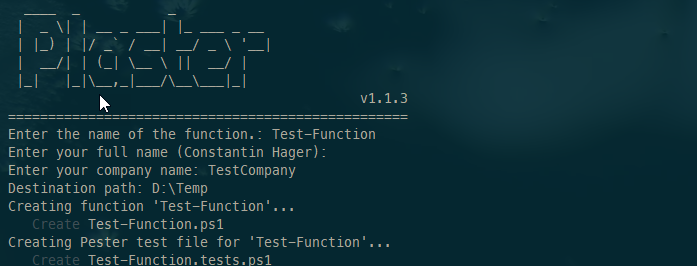
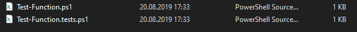
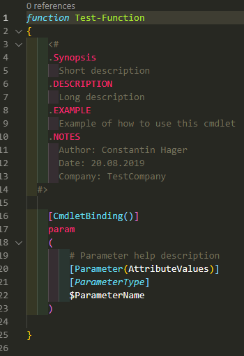
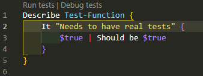
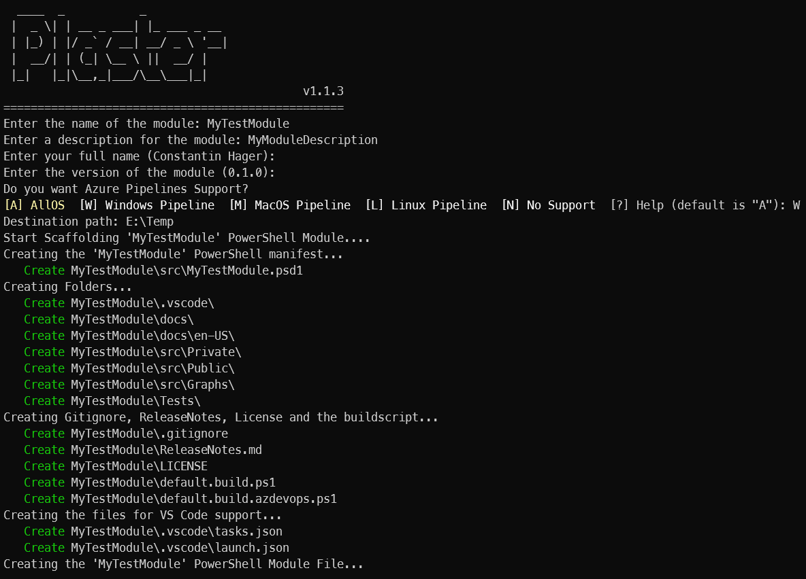
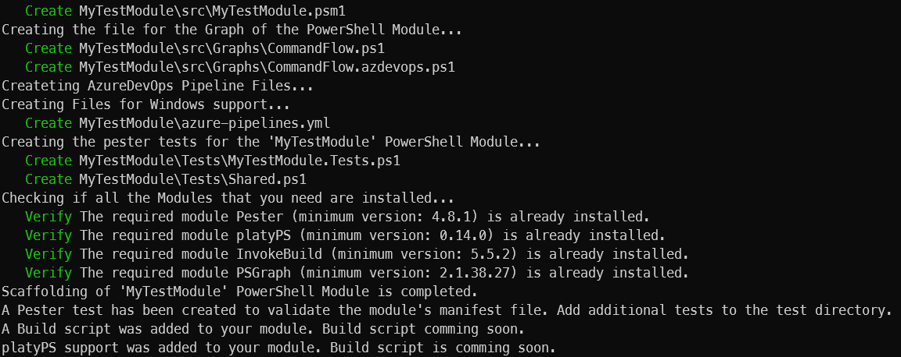
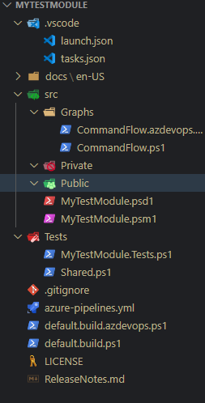
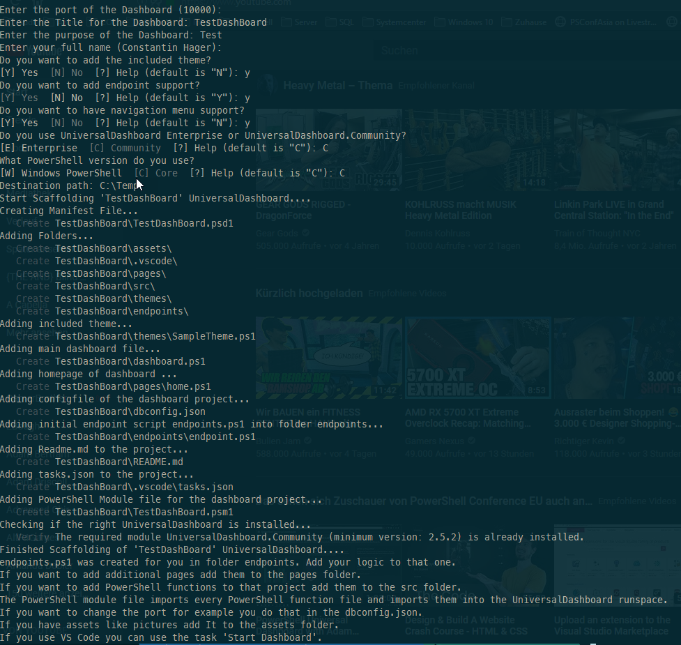
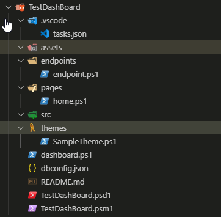

# My PlasterTemplates

Plaster Templates for the following Scaffolding purposes:

- Module
- Function
- Universal Dashboard

# Before using the templates

Install plaster from the PowerShellGallery:

```powershell
Install-Module Plaster -Scope CurrentUser
```

This Module is not yet in the PowerShell Gallery so please clone It or download the Zip.
Copy It in the standard PowerShell Module Path Directories.

If you run

```powershell
Get-PlasterTemplate -IncludeInstalledModules
```

you should see the following output:

```powershell
Title        : AddPSScriptAnalyzerSettings
Author       : Plaster project
Version      : 1.0.0
Description  : Add a PowerShell Script Analyzer settings file to the root of your workspace.
Tags         : {PSScriptAnalyzer, settings}
TemplatePath : xxxx

Title        : New PowerShell Manifest Module
Author       : Plaster
Version      : 1.1.0
Description  : Creates files for a simple, non-shared PowerShell script module.
Tags         : {Module, ScriptModule, ModuleManifest}
TemplatePath : xxxx

Title        : Function
Author       : Constantin Hager
Version      : 1.0.0
Description  : Plaster Manifest for creating PowerShell functions
Tags         : Function
TemplatePath : xxxx

Title        : Module
Author       : Constantin Hager
Version      : 0.1.0
Description  : My sample module Template
Tags         : {Module, Build}
TemplatePath : xxxx

Title        : UniversalDashboard
Author       : Constantin Hager
Version      : 1.0.0
Description  : Template to create an Universal Dashboard Project
Tags         : UniversalDashboard
TemplatePath : xxxx
```

The first two templates came with Plaster and the last three templates are
the templates which came with my Module.

Plaster always needs the full TemplatePath. You can get the path by running the following PowerShell command:

This is an example for the Plaster template UniversalDashboard.

```powershell
$TemplatePath = ((Get-PlasterTemplate -IncludeInstalledModules).where{$_.Title -eq "UniversalDashboard"}).TemplatePath
```

# How to use the Plaster Templates

## Function

This is the easiest Plaster template in this collection. You do not need any prerequisites.

Just ran

```powershell
$TemplatePath = ((Get-PlasterTemplate -IncludeInstalledModules).where{$_.Title -eq "Function"}).TemplatePath

Invoke-Plaster -TemplatePath $TemplatePath -DestinationPath "Your Destination"
```

You have to answer three questions:

- The name of the function
- The author of the function
- The company where the author works

The screen will look like this:



The File structure should look like this:



If you open your function file the following things are already there:

- The function has the name that you provided earlier.
- Comment based help is added also. In the notes section you will find information
  about the Author, the Date when the function was created and the company that the
  user provided.
- An empty parameter is also added in the template.

The function looks like this:



The second file is the Pester test file for that function.



## Module

Note:
You need to have the following modules installed:

- Pester
- PSGraph
- InvokeBuild
- PlatyPS

Their availability will also be checked in the plaster module scaffolding process.

To scaffold a module please run the following code:

```powershell
$TemplatePath = ((Get-PlasterTemplate -IncludeInstalledModules).where{$_.Title -eq "Module"}).TemplatePath

Invoke-Plaster -TemplatePath $TemplatePath -DestinationPath "Your Destination"
```

You have to answer the following questions:

- Name of the module
- Description of the module
- Author of the module
- Version of the module
- Azure Pipelines Support?
  - Multi OS
  - Linux
  - Mac OS
  - Windows

The Plaster experience should look like this:




The example below shows a sample folder structure.



### Explanation of folder structure

- .vscode: If you use VS Code the template created a task to launch the dashboard.
- docs\en-US: The help files that are build with platyPS are stored there. This folder gets updated with every CI build through
  Azure DevOps or you can run the build script locally to add the help markdown files but the preferred way is through the
  Azure DevOps CI pipeline.
- src\Graphs: This module makes use of the PSGraph module. There is a basic graph visualization of all your functions. You
  do not need to change this files. You can run the build script with the vscode task runner to create one.
- src\Private: Store all your functions in this folder that should not be exposed through the module. Create a file for every
  function you write.
- src\Public: Store all your functions in this folder that should be exposed through the module. Create a file for every
  function you write.
- src\MyTestModule.psd1: The module manifest for the module that you develop.
- src\MyTestModule.psm1: The module file where you can implement all your functions or you can use a loop to import them
  automatically at module runtime.
- Tests: The folder where all your tests should be stored
- Tests\MyTestModule.Tests.ps1: Some basic tests for your module. The module manifest will be tested and also every function
  will be tested for correct PowerShell code
- Tests\Shared.ps1: All stuff that is needed by all the tests should be added there.
- azure-pipelines.yml: The CI / CD Pipeline for Azure DevOps. This pipeline will build, test and deploy your code to
  the PowerShell Gallery. If you want to Publish your Module to the PowerShell Gallery you need to create a Pipeline variable
  PSGallery. This variable needs to be a secret.
- default.build.azdevops.ps1: The build script for Azure DevOps
- default.build.ps1: The build script for building the code locally.

## Universal Dashboard

Note:
You need to have the current PowerShell get installed, because the module Author
wants you to accept a license agreement.

You update to the current version of PowerShell get by running the following
PowerShell Script:

```powershell
Install-Module -Name PowerShellGet -Force
```

Restart you current PowerShell session to work with the current PowerShell Get.

Before you use this you need UniversalDashboard or UniversalDashboard.Community.
You can install one of the products by executing the following PowerShell scripts:

UniversalDashboard

```powershell
Install-Module -Name UniversalDashboard -AcceptLicense
```

UniversalDashboard.Community

```powershell
Install-Module -Name UniversalDashboard.Community -AcceptLicense
```

After installing UniversalDashboard run the template

```powershell
$TemplatePath = ((Get-PlasterTemplate -IncludeInstalledModules).where{$_.Title -eq "UniversalDashboard"}).TemplatePath

Invoke-Plaster -TemplatePath $TemplatePath -DestinationPath "Your Destination"
```

You have to answer the following questions:

- The port of the dashboard (Standard is 10000)
- The title of the dashboard
- A description of the dashboard
- The author of the dashboard
- Do you want to include a custom theme?
- Do you want to add one endpoint to your dashboard?
- Do you want to have a included navigation bar support?
- What Dashboard version do you use? UniversalDashboard or UniversalDashboard.Community
- Do you want to run your Dashboard in Windows PowerShell or on PowerShell Core?

The Plaster experience should look like this:



The example below shows a sample folder structure If you answer all questions with Yes.



### Explanation of folder structure

- .vscode: If you use VS Code the template created a task to launch the dashboard.
- assets: this is an empty folder for pictures and so on.
- endpoints: If you want to use the dashboard to precache data you can implement that in the endpoint.ps1
- pages: the folder where all your pages for universal dashboard are stored.
- src: All functions of the dashboard module (in this case TestDashBoard.psm1) should be stored there. Create a file for every function. All functions will be picked up and imported in the runspace of the dashboard.
- themes: A sample theme is already there. This will be automatically imported. It can be extended if needed.
- dashboard.ps1: Call this script to execute the dashboard.
- dbconfig.json: This file can be extended as you like. Initial values are:
  - port
  - title
  - rootmodule.
- README.md: The manual for your dashboard.
- TestDashBoard.psd1: The module manifest for the dashboard module.
- TestDashBoard.psm1: The module file for the dashboard module.

# Note

This was inspired by the following projects

- Plaster Project Template [NewModule](https://github.com/PowerShell/Plaster/tree/master/examples/NewModule)
- The Plaster Template Repo by dchristian3188 [PlasterTemplates](https://github.com/dchristian3188/PlasterTemplates)
